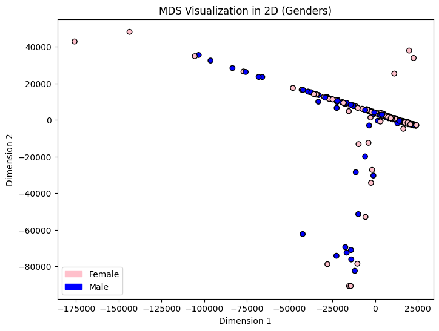
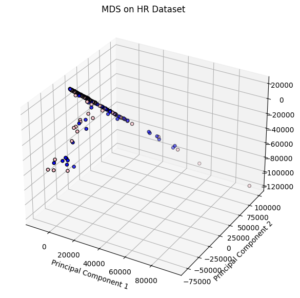
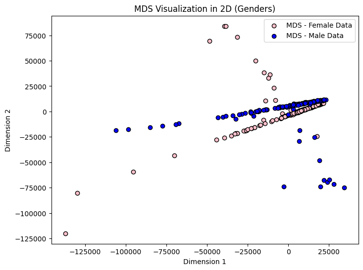

# Dimensionality Reduction - Report

## HR-Daten (= kleiner Datensatz)

### MDS

Die Visualisierung der Ergebnisse von MDS zeigt, dass die meisten Datenpunkte auf einer Geraden mit einer gewissen Steigung liegen. Das könnte daraufhin deuten, dass die Daten auf irgendeine Weise 

Es hat wenig Mehrwert, MDS auf mehr als 2 Dimensionen anzuwenden, denn vergleicht man die Visualisierungen von MDS in 2D und 3D, so hat die Visualisierung in 3D wenig extra Information im Gegensatz zu 2D.

| 2D | 3D |
|----|----|
|  |  |

Betrachtet man die Daten getrennt voneinander anhand der Geschlechter sieht man, dass die meisten Daten pro Geschlecht auf einer Geraden liegen und es in beiden Geschlechtern Ausreißer gibt, bei den Frauen mehr als bei den Männern.

