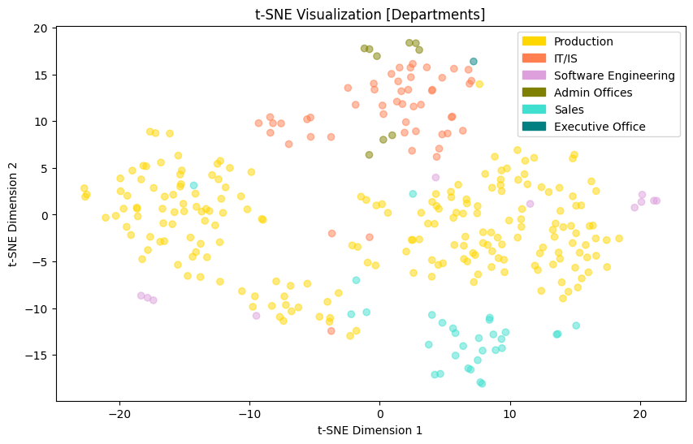

# Dimensionality Reduction - Report

## HR-Daten (= kleiner Datensatz)

### MDS

Die Visualisierung der Ergebnisse von MDS zeigt, dass die meisten Datenpunkte linear zusammenhängen. Die Attribute könnten z.B. auf das Gehalt hindeuten, oder den EngagementScore.

Es hat wenig Mehrwert, MDS auf mehr als 2 Dimensionen anzuwenden, denn vergleicht man die Visualisierungen von MDS in 2D und 3D, so hat die Visualisierung in 3D wenig extra Information im Gegensatz zu 2D.

Generell kann man sagen, 

| 2D | 3D |
|----|----|
|  |  |

Betrachtet man die Daten getrennt voneinander anhand der Geschlechter sieht man, dass die meisten Daten pro Geschlecht auf einer Geraden liegen und es in beiden Geschlechtern Ausreißer gibt, bei den Frauen mehr als bei den Männern.

### PCA 

Nach Herumprobieren habe ich PCA mit dem Performance Score colorgecodet, da man hier die deutlichsten Gruppierungen erkennen konnte. Außerdem macht hier eine Berechnung von 3 Dimensionen durchaus Sinn, da die dritte Dimension zusätzliche Informationen bringt.

| 2D | 3D |
|----|----|
|  |  | 

Erkennbar ist, dass die Kategorie "PIP" aus dem Performance Score vor allem im oberen Bereich verteilt ist, gefolgt von "Needs Improvement", "Fully Meets" und schließlich "Exceeds" ganz unten. Gerade die Punkte, die unter "Exceeds" fallen mischen sich mit der zweitbesten Kategorie "Fully Meets".

### t-SNE

 

In der Visualisierung mit t-SNE habe ich die unterschiedlichen Departments der Firma dargestellt, da man hier am ehesten etwas erkennen kann.

| | | 
|----|----|
| |  | 

Ich habe das Verfahren ein paar Mal angewandt und bin schließlich auf diese Variainte gekommen, die nicht color-coded ist. In dieser Visualisierung kann man vage erkennen, dass sich die Daten natürlicherweise clustern.

## Diabetes Daten (Großer Datensatz)

### MDS

ich habe versucht MDS auf die Daten anzuwenden, aber offenbar ist die Datenmenge zu groß, um das Verfahren anzuwenden.

### PCA 

im PCA-Verfahren kann man relativ wenig erkennen, weder mit zwei, noch mit 3 Dimensionen. Die Daten werden sehr homogen darfgestellt und es können keine Muster erkannt werden. Ich habe versucht, unterschiedliche Kategorien farblich hervorzuheben, allerdings hat dies zu keinem zufriedenstellenden Ergebnis geführt.

| 2D (Geschlecht) | 3D (Alter)|
|----|----|
|  |  | 

### t-SNE

Bei der Dimensionsreduktion mithilfe von t-SNE kann man bei dem größeren Datensatz mMn. noch besser natürliche Cluster sehen.

Bei dem Datensatz konnte ich keine Zusammenhänge zu den Attributen herausfinden, zu denen man eine Verbindung sehen konnte. Dennoch kann man Gruppen an Daten gut erkennen, die ähnlich zu einander sind, dies wird durch die örtliche Nähe im Scatterplot sichtbar.

### UMAP

Zuletzt habe ich UMAP auf die Diabetes-Daten angewandt. Das Ergebnis ähnelt dem des t-SNE-Verfahrens.

# Fazit

Die Dimensionsreduktion scheint hilfreich, wenn man z.B. t-SNE verwendet, um zu sehen, wie sich die Daten evtl. ähneln. Dann muss man noch immer ausprobieren und schauen, wo die Zusammenhänge sind, denn diese Information erhält man natürlich nicht über die Verfahren. Gerade bei dieser Übung war es für mich ein langes Herumprobieren und ein Testen, durch welche Verfahren man die besten Ergebnisse erzielen könnte. 
Das haben wir in der Vorlesung auch schon gehört - aber ich sehe mich bestätigt darin, dass nicht alle Methoden für alle Datensätze passen und es ein langes Herumprobieren ist.